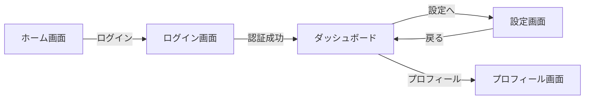
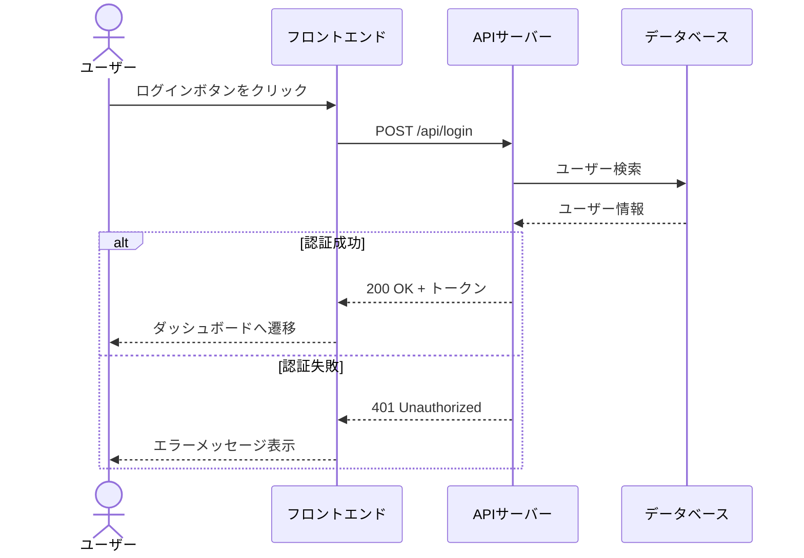
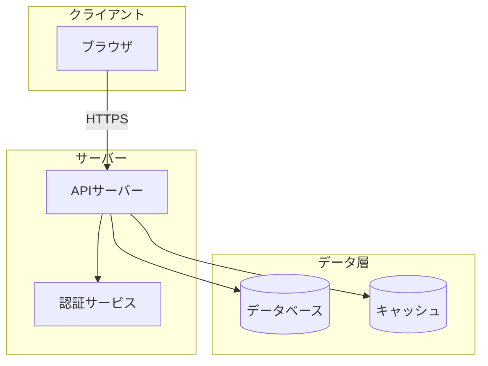
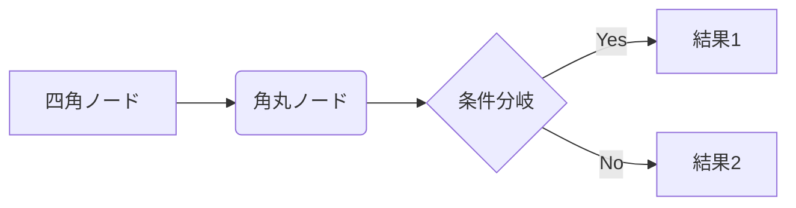
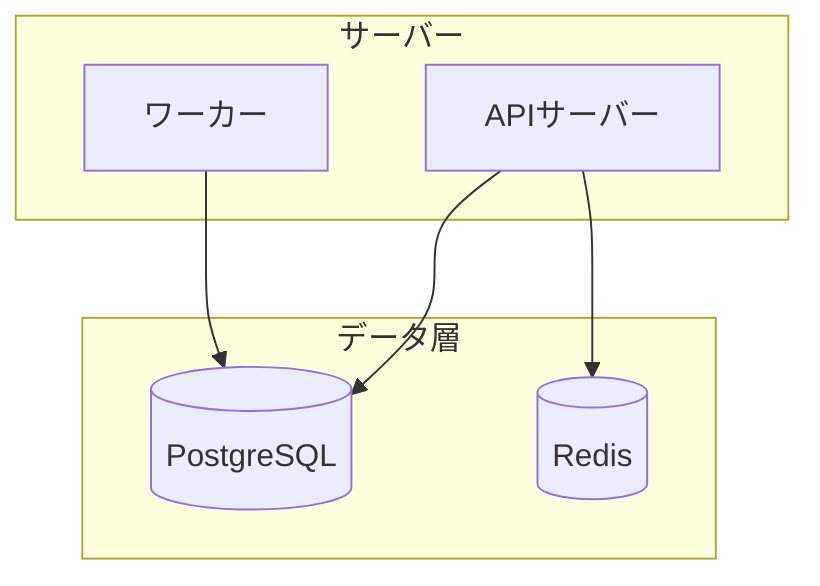
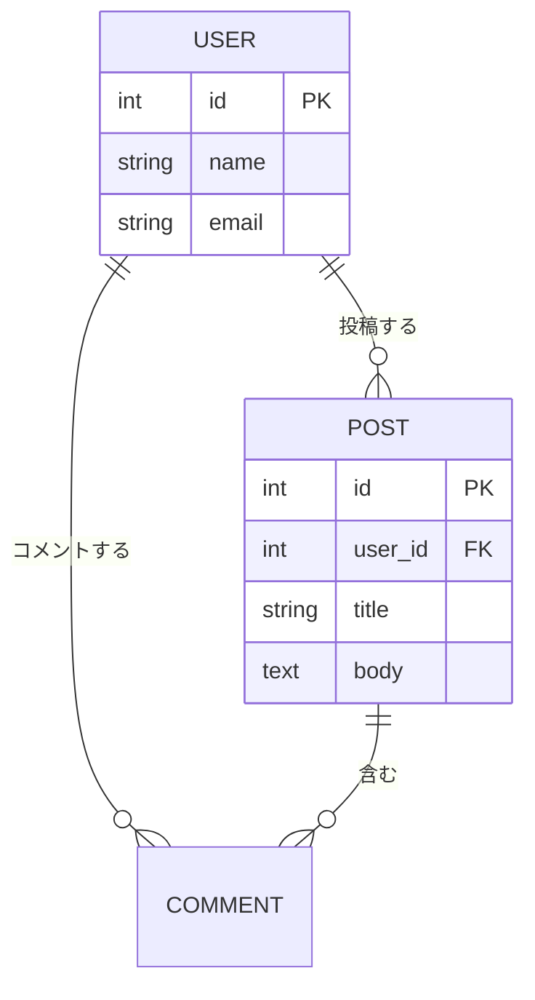

# 要件ファイルテンプレート

## overview.md

```markdown
# {アプリ名}

## コンセプト

{1-2文でアプリの核心を簡潔に}

## ターゲットユーザー

{想定ユーザー層と、そのユーザーが抱える課題}

## 機能一覧

| ID | 機能名 | 概要 | 優先度 |
|----|--------|------|--------|
| 01 | ... | ... | 高/中/低 |

## マネタイズ

{収益化の方針。フリーミアム/サブスク/広告/買い切り等の具体的なモデル}

## コスト分析

### 初期開発コスト

| 項目 | 概算 | 備考 |
|------|------|------|
| ドメイン取得 | ¥1,500/年 | .com等 |
| 外部API初期設定 | ¥0 | 無料枠利用 |
| ... | ... | ... |
| **合計** | **¥X,XXX** | |

### 月額運用コスト

| 項目 | 月額概算 | 備考 |
|------|----------|------|
| ホスティング | ¥X,XXX | {サービス名} {プラン名} |
| データベース | ¥X,XXX | {サービス名} {プラン名} |
| 外部API | ¥X,XXX | {サービス名}（{使用量の想定根拠}） |
| ... | ... | ... |
| **合計** | **¥X,XXX/月** | |

### 収支シミュレーション

| 指標 | 値 | 根拠 |
|------|-----|------|
| 想定ユーザー数（6ヶ月後） | X,XXX人 | {根拠} |
| 月間売上（6ヶ月後） | ¥XX,XXX | {マネタイズモデルに基づく計算} |
| 月間運用コスト | ¥X,XXX | 上記運用コスト参照 |
| **月間利益** | **¥XX,XXX** | |
| 初期投資回収 | X ヶ月 | |

{収支に関する補足説明。スケール時のコスト変動、損益分岐点の分析等}

## 技術スタック（提案）

{推奨する技術構成。フロントエンド/バックエンド/DB/インフラ等}

{制約条件で tech_stack が指定されている場合、指定された技術を必ず採用し、その上で不足する部分を補完する。指定技術を別の技術に置き換えてはならない。指定がない場合はAIが最適な技術を自由に選定する}

## 運用方針

{インフラ構成・デプロイ方式・監視・スケーリング等}
```

## features/{feature_id}_{feature_name}.md

```markdown
# {機能名}

## 概要

{この機能が解決する課題と提供する価値}

## 画面構成

{画面の説明。主要なUI要素、レイアウト、画面遷移を具体的に}

## ユーザーフロー

{操作手順をステップで記述}

1. ユーザーが〜する
2. システムが〜を表示する
3. ...

## データモデル

{この機能に関連するデータ構造。テーブル/コレクション定義}

## API設計

{必要なエンドポイント}

| メソッド | パス | 概要 |
|----------|------|------|
| GET | /api/... | ... |

## 非機能要件

{パフォーマンス目標、セキュリティ要件、アクセシビリティ等}
```

## diagrams/{diagram_id}_{diagram_name}.md

overview.mdと各機能の仕様内容に基づき、Mermaid記法でアプリケーションの設計図を1図解1ファイルで作成する。ファイル名は `{nn}_{snake_case}.md` 形式（featuresと同じ命名規則）。

### 必須: 画面遷移図（例: `01_screen_transition.md`）

````markdown
# 画面遷移図

アプリの主要画面間のナビゲーション遷移を示す。


````

### 任意: ユーザーフロー図（例: `02_user_flow_login.md`）

````markdown
# ユーザーフロー: ログイン

ログイン処理のユーザーフローを示す。


````

### 任意: システム構成図（例: `03_system_architecture.md`）

````markdown
# システム構成図

フロントエンド・バックエンド・DB・外部サービスの構成を示す。


````

### diagrams/ 作成時の注意事項

- 1図解1ファイル。ファイル名は `{nn}_{snake_case}.md` 形式
- 各ファイルの先頭に `# タイトル` を記述（Viewerで表示される）
- Mermaidコードブロックは必ず ` ```mermaid ` で開始し ` ``` ` で閉じる
- **画面遷移図は必須**。それ以外はアプリの特性に合わせて自由に追加する
- 図解の種類に制限はない: フローチャート、シーケンス図、ER図、ステート図、ガントチャート等、要件の理解に役立つものを選ぶ
- ラベルやコメントは日本語で記述する
- overview.mdの機能一覧・技術スタックと整合性を保つこと
- 上記テンプレートはあくまで構造の例。実際のアプリの内容に合わせて図の中身を具体的に記述すること

## Mermaid記法リファレンス

Mermaid.jsの主要な記法。公式ドキュメント: https://mermaid.js.org/

### フローチャート（graph）



**方向指定**: `graph TB`（上→下）, `graph BT`（下→上）, `graph LR`（左→右）, `graph RL`（右→左）

**ノード形状**:
- `A[テキスト]` — 四角
- `A(テキスト)` — 角丸
- `A([テキスト])` — スタジアム型
- `A{テキスト}` — ひし形
- `A[(テキスト)]` — 円柱（DB）
- `A((テキスト))` — 円
- `A>テキスト]` — 旗型

**矢印の種類**:
- `-->` — 実線矢印
- `---` — 実線（矢印なし）
- `-.->` — 点線矢印
- `==>` — 太線矢印
- `-->|ラベル|` — ラベル付き矢印

### サブグラフ（グループ化）



### シーケンス図


**メッセージの種類**:
- `->>` — 実線（同期）
- `-->>` — 点線（レスポンス）
- `--)` — 非同期メッセージ

**制御構文**:
- `alt` / `else` / `end` — 条件分岐
- `opt` / `end` — オプション
- `loop` / `end` — ループ
- `par` / `and` / `end` — 並列処理
- `Note over A,B: テキスト` — ノート

### ER図



**カーディナリティ**:
- `||--||` — 1対1
- `||--o{` — 1対多
- `o{--o{` — 多対多

## _source_info.json

```json
{
  "source": {
    "directory": "gen/data_source/{タイムスタンプ}/",
    "collected_at": "{yyyy-MM-dd HH:mm:ss形式の収集日時}"
  },
  "keywords": [
    { "word": "{採用キーワード1}", "relevance": 0.90 },
    { "word": "{採用キーワード2}", "relevance": 0.85 }
  ],
  "tags": ["{タグ1}", "{タグ2}", "{タグ3}"],
  "constraints": {
    "platform": "{frontend-only | fullstack | mobile-android | mobile-ios | mobile-cross}",
    "budget": "{free | low | moderate | high}",
    "difficulty": "{easy | medium | hard}",
    "team_size": "{solo | small | medium | large}",
    "tech_stack": {
      "frontend": "{指定フレームワーク}",
      "backend": "{指定フレームワーク}",
      "database": "{指定サービス}",
      "hosting": "{指定サービス}",
      "auth": "{指定サービス}",
      "other": ["{その他サービス1}", "{その他サービス2}"]
    }
  },
  "description": "{なぜこのアプリ案が生まれたか。どのキーワード/トレンドの組み合わせから着想したかを人間が理解できるように簡潔に}"
}
```

**タグ値**: `gen/tags.json` に定義されたタグから最低3つ選択すること。該当するタグがない場合は `gen/tags.json` に新しいタグを追加してから使用する

**制約条件**: `constraints` フィールドはオプション。制約条件が指定されている場合のみ記録する。指定されていないフィールドは省略可。有効な値:
- `platform`: `frontend-only`（フロントエンドのみ）/ `fullstack`（フルスタック）/ `mobile-android` / `mobile-ios` / `mobile-cross`（クロスプラットフォームモバイル）
- `budget`: `free`（無料枠のみ）/ `low`（〜$50/月）/ `moderate`（〜$500/月）/ `high`（上限なし）
- `difficulty`: `easy`（初心者向け）/ `medium`（中級者向け）/ `hard`（上級者向け）
- `team_size`: `solo`（1人）/ `small`（2-3人）/ `medium`（4-8人）/ `large`（9人以上）
- `tech_stack`: ユーザーが指定したベース技術スタック。各フィールドは任意の文字列。指定された技術は必ず採用し、概要の「技術スタック（提案）」セクションに反映すること

## _source_info.json（データセットモード用）

データセットから要件を生成した場合は、以下のスキーマで `_source_info.json` を出力する:

```json
{
  "source": {
    "directory": "dataset://{データセット名}",
    "collected_at": "{yyyy-MM-dd HH:mm:ss形式の生成日時}"
  },
  "dataset": {
    "name": "{データセット名}",
    "sourceApps": [
      { "appName": "{参照元アプリ名}", "type": "overview" },
      { "appName": "{参照元アプリ名}", "type": "feature", "featureId": "{機能ID}", "title": "{機能タイトル}" }
    ]
  },
  "keywords": [
    { "word": "{採用キーワード1}", "relevance": 0.90 }
  ],
  "tags": ["{タグ1}", "{タグ2}", "{タグ3}"],
  "description": "{なぜこのアプリ案が生まれたか}"
}
```

- `source.directory` は `dataset://{データセット名}` 形式にする
- `dataset.sourceApps` にはデータセットに含まれる全アイテムを列挙する
- 各 `sourceApps` 項目の `type` は `"overview"` または `"feature"`。`type: "feature"` の場合は `featureId` と `title` も含める
